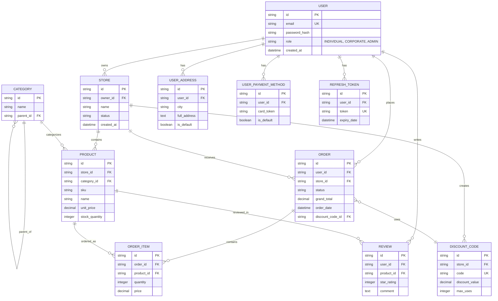

# CHRONOS Database Normalization Process and ER Diagram

This document details the database architecture design process for the CHRONOS e-commerce platform, tracing its evolution from the Unnormalized Form (UNF) to the Third Normal Form (3NF), and culminating in the final Entity-Relationship (ER) diagram.

---

## 1. Introduction and Core Concepts

In relational database design, **Normalization** is the process of organizing tables to minimize data redundancy and ensure data integrity. 

Below, we will examine how an order receipt/invoice in the CHRONOS system is incrementally normalized step-by-step.

---

## 2. UNF (Unnormalized Form)

In the initial design phase (or when looking at a raw paper invoice), all data might be stored in a single, massive "Order Report" table.

**Example UNF Table (Order_Report):**
| OrderID | UserEmail | UserName | UserCity | StoreName | OrderDate | ProductList (SKU, Name, Price, Qty) | GrandTotal |
|---------|-----------|----------|----------|-----------|-----------|-------------------------------------|------------|
| O-1001  | a@a.com   | Ali Y.   | Istanbul | TechStore | 2026-04-20| P1(Laptop, 5000, 1), P2(Mouse, 100, 2) | 5200       |
| O-1002  | b@b.com   | Veli Z.  | Ankara   | ShoeShop  | 2026-04-21| P3(Sneaker, 300, 1)                    | 300        |

### Problems with UNF:
- **Non-Atomic Data:** The `ProductList` column contains multiple values (comma-separated or as a list) within a single cell.
- **Data Redundancy (Insert/Update Anomaly):** If a user's address or a store's name changes, we would have to update every single past order row associated with that user or store.

---

## 3. 1NF (First Normal Form)

**Rule:** Every cell must contain a single, **atomic** value, and there must be no repeating groups. Each row must be uniquely identified by a Primary Key.

We split the `ProductList` column by duplicating the rows for each product.

**1NF Table:**
| OrderID | UserEmail | UserName | UserCity | StoreName | OrderDate | ProductSKU | ProductName | ProductPrice | Qty |
|---------|-----------|----------|----------|-----------|-----------|------------|-------------|--------------|-----|
| O-1001  | a@a.com   | Ali Y.   | Istanbul | TechStore | 2026-04-20| P1         | Laptop      | 5000         | 1   |
| O-1001  | a@a.com   | Ali Y.   | Istanbul | TechStore | 2026-04-20| P2         | Mouse       | 100          | 2   |
| O-1002  | b@b.com   | Veli Z.  | Ankara   | ShoeShop  | 2026-04-21| P3         | Sneaker     | 300          | 1   |

**Primary Key:** The composite key is `(OrderID, ProductSKU)`.

---

## 4. 2NF (Second Normal Form)

**Rule:** The table must be in 1NF and must not contain any **Partial Dependencies**. This means non-key columns cannot depend on only a *part* of a composite primary key.

In the 1NF table above:
- `ProductName` and `ProductPrice` depend *only* on the `ProductSKU` (not the OrderID).
- `UserEmail`, `OrderDate`, and `StoreName` depend *only* on the `OrderID` (not the ProductSKU).

To resolve these partial dependencies, we split the data into separate tables:

**Table 1: ORDERS** (PK: OrderID)
| OrderID | UserEmail | UserName | UserCity | StoreName | OrderDate |
|---------|-----------|----------|----------|-----------|-----------|
| O-1001  | a@a.com   | Ali Y.   | Istanbul | TechStore | 2026-04-20|

**Table 2: PRODUCTS** (PK: ProductSKU)
| ProductSKU | ProductName | ProductPrice |
|------------|-------------|--------------|
| P1         | Laptop      | 5000         |
| P2         | Mouse       | 100          |

**Table 3: ORDER_ITEMS** (PK: OrderID, ProductSKU)
| OrderID | ProductSKU | Qty |
|---------|------------|-----|
| O-1001  | P1         | 1   |
| O-1001  | P2         | 2   |

---

## 5. 3NF (Third Normal Form)

**Rule:** The table must be in 2NF and must not contain any **Transitive Dependencies**. This means a non-key column cannot depend on another non-key column.

In the `ORDERS` table above:
- `UserEmail` is not a key. However, `UserName` and `UserCity` do not directly depend on the `OrderID`; they actually depend on the `UserEmail` (The User).
- Similarly, `StoreName` is a property of the Store, not the Order itself.

We isolate these transitive dependencies into their own domain tables:

**Table 1: USERS** (PK: UserID)
| UserID | Email     | Name   |
|--------|-----------|--------|
| U-1    | a@a.com   | Ali Y. |

**Table 2: USER_ADDRESSES** (PK: AddressID)
| AddressID | UserID | City     |
|-----------|--------|----------|
| A-1       | U-1    | Istanbul |

**Table 3: STORES** (PK: StoreID)
| StoreID | StoreName |
|---------|-----------|
| S-1     | TechStore |

**Table 4: ORDERS (Updated)** (PK: OrderID)
| OrderID | UserID | StoreID | OrderDate |
|---------|--------|---------|-----------|
| O-1001  | U-1    | S-1     | 2026-04-20|

Now, the CHRONOS database is fully **3NF** compliant. If we ever need to update a user's name or a store's name, we only modify a single row in the `USERS` or `STORES` table. There are zero insert, update, or delete anomalies.

---

## 6. Final ER (Entity-Relationship) Diagram

Below is the current ER Diagram of the CHRONOS platform, fully designed according to 3NF rules and directly mapped to the Spring Data JPA Entities:

## 7. Conclusion

Bringing the database to a 3NF structure provides the CHRONOS platform with the following architectural advantages:
1. **Data Integrity:** All Foreign Key (FK) constraints are strictly enforced at the PostgreSQL level. For example, if a user is deleted, their addresses are safely and automatically removed via `CascadeType.ALL`.
2. **High Performance:** When paired with proper indexing (`@Table(indexes = ...)`), `JOIN` operations across these normalized tables execute extremely fast.
3. **Modularity & Flexibility:** When new modules (such as a "Wishlist") need to be added, it only requires creating a new Cross-Reference (junction) table between `USER` and `PRODUCT`. The core architecture remains entirely unaffected.
